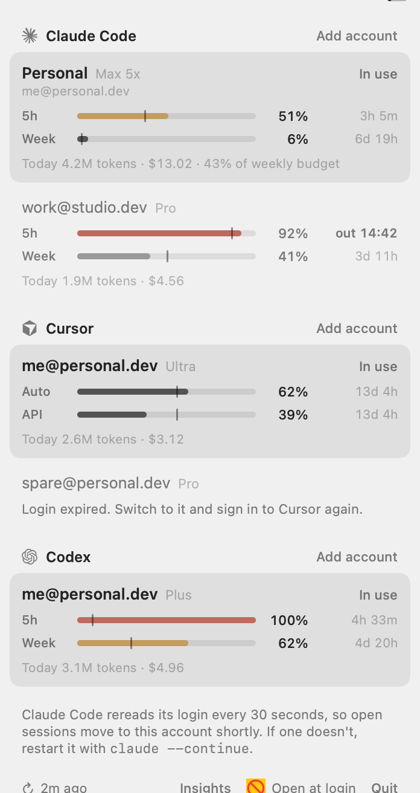
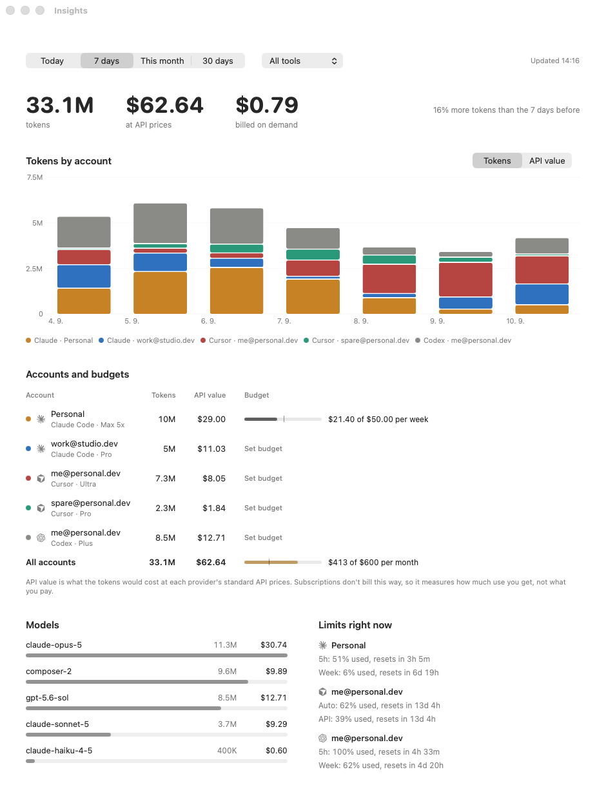
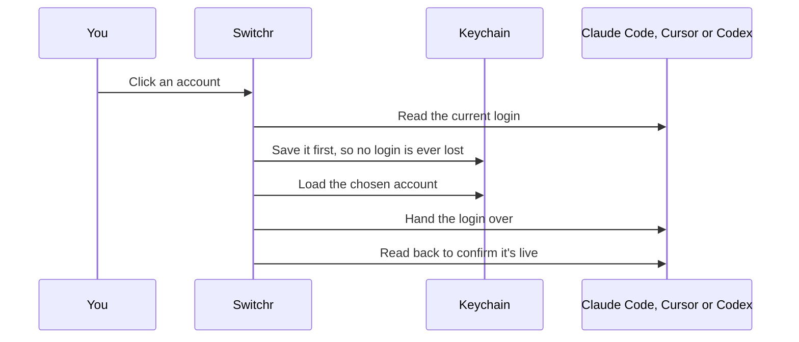

<p align="center">
  
</p>

<p align="center">
  Move Claude Code, Cursor or Codex onto another account in one click,<br>
  with every saved account's live limits in view.
</p>

<p align="center">
  <sub>macOS 14 or later · Apple silicon and Intel · runs in the menu bar</sub>
</p>

<p align="center">
  <picture>
    <source media="(prefers-color-scheme: dark)" srcset="docs/menu-dark.png">
    
  </picture>
</p>

## Install

```bash
curl -fsSL https://raw.githubusercontent.com/dominikzabcik/switchr/main/install.sh | bash
```

The installer downloads the latest release, checks its SHA-256, installs Switchr into Applications and opens it. Files downloaded this way aren't flagged by Gatekeeper, so macOS doesn't show a security prompt. [Read the script](install.sh) before piping it into your shell.

<details>
<summary><b>Prefer a disk image?</b></summary>
<br>

Download `Switchr.dmg` from the [latest release](../../releases/latest), open it, and drag Switchr into Applications.

Switchr isn't notarized, so macOS blocks the first launch. Open **System Settings › Privacy & Security** and choose **Open Anyway**. If you launch Switchr straight from the disk image or from Downloads, it offers to move itself into Applications.

</details>

On first launch, a welcome window lists the logins Switchr found and turns on Open at login. When you close it, the menu bar icon plays a short animation so you can spot it.

<p align="center">
  
</p>

## Use

| | |
| --- | --- |
| **Add an account** | Sign in to the tool as usual. Switchr notices the login and saves it. For another account, click **Add account**. Switchr signs the tool out on this Mac only, leaving the saved token valid, and saves the next login you make. |
| **Switch** | Click an account row. Right-click a row to rename or remove it. |
| **Read the bars** | Each bar is how much of a limit you've used. The tick marks an even pace through the window. A bar turns amber when you're ahead of pace and red past 90%. |
| **Menu bar icon** | The in-use account's two nearest limits, for the tool you switched last. |

## Usage tracking

Switchr keeps its own record of what every account uses. Nothing leaves your Mac except the usage requests each provider already answers.

| Source | What Switchr reads |
| --- | --- |
| Claude Code | `~/.claude/projects/**/*.jsonl`, one entry per response, with input, cache writes (5-minute and 1-hour), cache reads and output |
| Codex | `~/.codex/sessions/**/*.jsonl`, per-response usage records, or running totals in older sessions |
| Cursor | Each saved account's usage export from cursor.com, at most twice an hour |

- **Per account:** each request is credited to the account that was in use at that moment. Switchr records every switch, including logins you change outside it. Usage from before Switchr started goes to the tool's only saved account when there's one.
- **API value:** requests are priced at each provider's standard API rates, from a table generated from [models.dev](https://models.dev). Subscriptions don't bill per token, so treat API value as a measure of how much use you get, not of what you pay. Cursor's on-demand charges are shown separately as billed.
- **Budgets:** set one per account or across all accounts, per day, week or month, from the Insights window. Switchr notifies you at 80% and at 100%.
- **Forecasts:** Switchr samples each limit every few minutes and projects when it runs out at the recent rate. The meter shows `out 14:32` when that comes before the reset. If the account in use gets close, a notification offers a **Switch** button that moves you to the saved account with the most room.
- **Incremental reads:** logs are read incrementally into `~/Library/Application Support/Switchr/usage.sqlite`. The first read of a large history takes a few seconds, and later refreshes only parse new lines.

<p align="center">
  
</p>

## What a switch does



| Tool | Where the login lives | How it takes the new one |
| --- | --- | --- |
| Claude Code | Keychain item `Claude Code-credentials` (only `claudeAiOauth`; MCP tokens stay untouched), plus `oauthAccount` in `~/.claude.json` | Claude Code rereads its Keychain login every 30 seconds, so open sessions move over without a restart. |
| Cursor | `cursorAuth/*` rows in `state.vscdb`, plus `authInfo` in `~/.cursor/cli-config.json` | An open Cursor gets the tokens through its own login deep link (`cursor://cursorAuth`) and switches in place in under a second. A closed Cursor has its rows swapped directly. |
| Codex | `~/.codex/auth.json` | New runs use it straight away. A running session keeps its original account, so reopen it with `codex resume --last`. |

Tools rotate their tokens on their own, so Switchr re-saves the in-use login on every refresh. Limits are fetched with each account's own token. Switchr only refreshes tokens for accounts that aren't in use, so a running session never has its token rotated out from under it.

## Storage and security

- **Saved logins** go in your login Keychain, service `dev.switchr.vault`, one item per account. Keychain calls go through `/usr/bin/security`, so there are no access prompts.
- **Account names and labels** go in `~/Library/Application Support/Switchr/accounts.json`. This file holds no tokens.
- **Switching** hands tokens to a tool in one of two ways. Keychain writes pass the credential as an argument to `security`, where other processes running as your user can briefly see it. The Cursor deep link goes through Launch Services and never appears in a process list.
- **Endpoints** are the private ones the tools call themselves, so a provider update can break Switchr. If that happens, [open an issue](../../issues/new/choose).

## Development

```bash
./scripts/build-app.sh --install   # universal build, copied to Applications and opened
./scripts/build-app.sh --release   # plus build/Switchr.zip, build/Switchr.dmg and SHA256SUMS
./scripts/render-art.sh            # re-render the icon, disk image background and banner
```

Debug flags on the binary:

| Flag | What it does |
| --- | --- |
| `--probe` | Prints each tool's current login and limits without changing anything |
| `--reapply <claude\|cursor\|codex>` | Switches a tool to the login it already has, which exercises the whole switch path |
| `--snapshot <prefix>` | Renders the menu and the welcome window with sample data to PNGs |

| Path | Contents |
| --- | --- |
| `Sources/Switchr/Providers` | One adapter per tool: read the login, apply one, sign out locally, fetch usage |
| `Sources/Switchr/Core` | Account store, Keychain vault, shell and HTTP helpers |
| `Sources/Switchr/UI` | Menu, welcome window, meters, brand |
| `scripts` | Build, art and disk image settings |
| `install.sh` | The one-line installer |

## Releasing

1. Bump `VERSION` and add a matching section to `CHANGELOG.md`.
2. Commit, then tag and push: `git tag v0.3.0 && git push origin v0.3.0`.

The [Release workflow](.github/workflows/release.yml) builds the universal app, zip, disk image and checksums, then publishes them with that changelog section as the release notes. [CI](.github/workflows/ci.yml) builds and smoke-tests every push.

## Terms and trademarks

Switchr moves between accounts you already have, such as a personal login and a work login. It doesn't give any account more usage than its plan includes. Using several accounts to get around one plan's limits can break a provider's terms, so read the terms for each service you use ([Anthropic](https://www.anthropic.com/legal/consumer-terms), [Cursor](https://cursor.com/terms-of-service), [OpenAI](https://openai.com/policies/row-terms-of-use/)) and use Switchr within them. Only save accounts that are yours: providers such as Anthropic don't allow sharing a login with anyone else.

Switchr is an independent project. It isn't affiliated with, endorsed by or sponsored by Anthropic, Anysphere or OpenAI. Claude, Claude Code, Cursor, Codex and OpenAI are trademarks of their owners, and their logos appear only to identify each tool.

## License

[MIT](LICENSE). Provider marks come from [Simple Icons](https://simpleicons.org), and model prices from [models.dev](https://models.dev). See [`NOTICE`](NOTICE).
