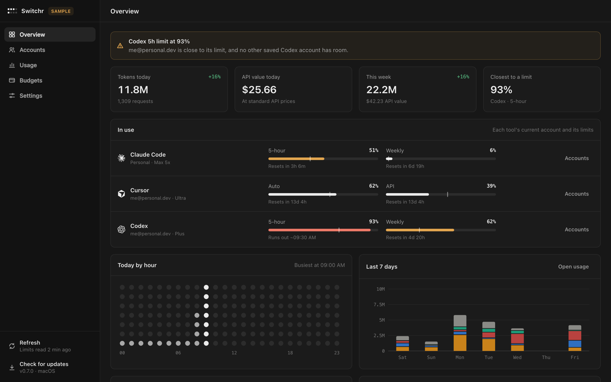
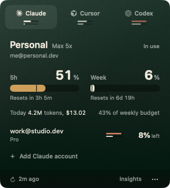
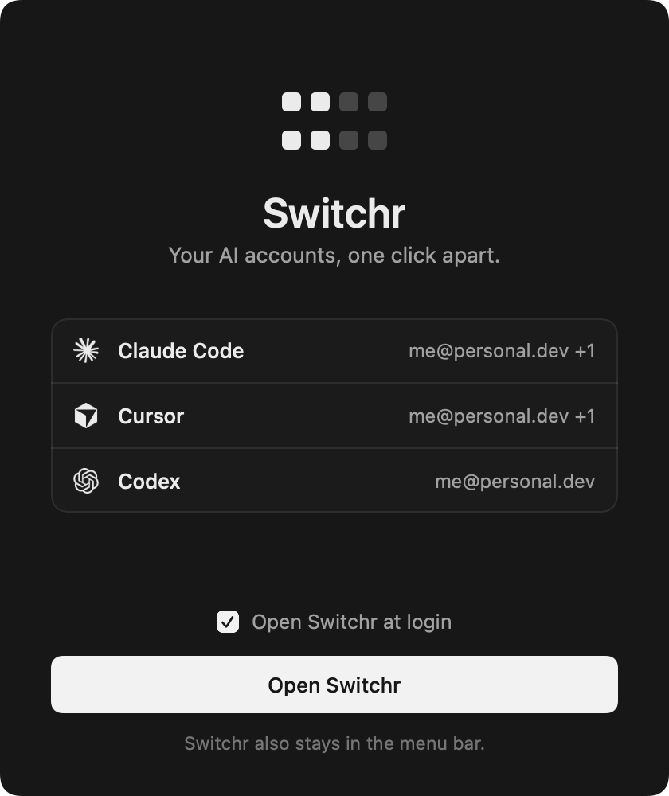
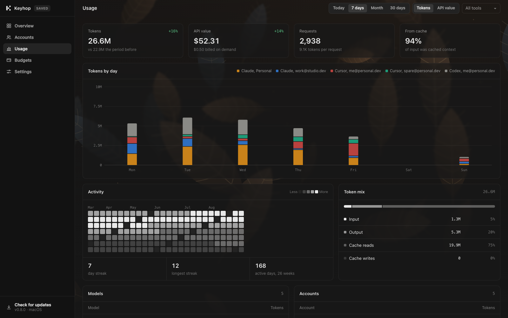
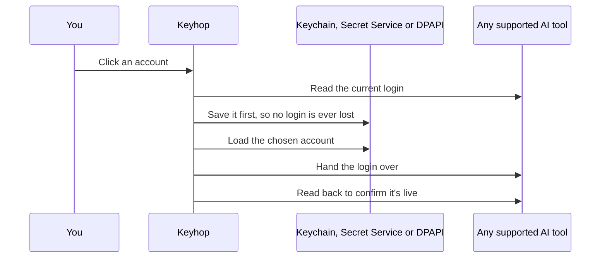

<p align="center">
  
</p>

<p align="center">
  Move Claude Code, Cursor, Codex, Gemini CLI, OpenCode, Pi, GitHub Copilot, Windsurf or Codebuff onto another account<br>
  in one click, with supported limits, local usage and budgets in view.
</p>

<p align="center">
  <a href="https://github.com/dominikzabcik/keyhop/actions/workflows/ci.yml"></a>
  <a href="https://github.com/dominikzabcik/keyhop/releases/latest"></a>
  <a href="LICENSE"></a>
</p>

<p align="center">
  <sub>macOS 14+ app and menu bar · Linux tray on x86_64 and aarch64 · Windows 10 and 11 notification area</sub>
</p>

<p align="center">
  
</p>

<p align="center">
  
</p>

## Install

**macOS and Linux**

```bash
curl -fsSL https://raw.githubusercontent.com/dominikzabcik/keyhop/main/install.sh | bash
```

**Windows** (PowerShell, no administrator rights needed)

```powershell
irm https://raw.githubusercontent.com/dominikzabcik/keyhop/main/install.ps1 | iex
```

Both installers download the latest release and check its SHA-256 before installing anything. [Read install.sh](install.sh) or [install.ps1](install.ps1) before piping them into a shell.

| System | What the installer does | Or install it yourself |
| --- | --- | --- |
| macOS 14 or later | Installs Keyhop into Applications, links the `keyhop` command onto your PATH, and opens it. Files downloaded this way aren't flagged by Gatekeeper, so there's no security prompt. | `Keyhop.dmg` from the [latest release](../../releases/latest), or `brew tap dominikzabcik/keyhop https://github.com/dominikzabcik/keyhop && brew install --cask keyhop` |
| Fedora, RHEL | Installs the RPM with `dnf` | `sudo dnf install ./keyhop-<version>-1.x86_64.rpm` |
| Debian, Ubuntu | Installs the DEB with `apt` | `sudo apt install ./keyhop_<version>_amd64.deb` |
| Arch Linux | Installs the package with `pacman` | `sudo pacman -U keyhop-<version>-1-x86_64.pkg.tar.zst`, or build the release's `keyhop-bin` PKGBUILD with `makepkg -si` |
| Any other Linux | Installs the portable build into `~/.local`, without root. Set `KEYHOP_LOCAL=1` to choose this anywhere. | Unpack `keyhop-<version>-linux-<arch>.tar.gz` and run `./install-local.sh` |
| Windows 10 and 11 | Installs into `%LOCALAPPDATA%\Programs\Keyhop`, adds `keyhop` to your PATH and the Start menu, and opens at sign-in. Windows on Arm runs the same build through its x64 emulation. | `scoop bucket add keyhop https://github.com/dominikzabcik/keyhop` then `scoop install keyhop` |

Every Linux download runs on x86_64 and aarch64. The `keyhop` binary is fully static, so it doesn't depend on your distribution's libraries. The tray uses GTK 3, AppIndicator and libnotify for Python, which the packages pull in.

<details>
<summary><b>macOS: installing from the disk image</b></summary>
<br>

Keyhop isn't notarized, so macOS blocks the first launch from the disk image. Open **System Settings › Privacy & Security** and choose **Open Anyway**. If you launch Keyhop straight from the disk image or from Downloads, it offers to move itself into Applications.

On first launch, a welcome window lists the logins Keyhop found and turns on Open at login, then Keyhop's window opens. Opening Keyhop again from Applications, Spotlight or the Dock brings the window back; at login it starts quietly in the menu bar.

<p align="center">
  
</p>

</details>

<details>
<summary><b>Linux: GNOME and the tray</b></summary>
<br>

With WebKitGTK for Python installed (the packages recommend it), **Open Keyhop** shows the dashboard in its own window; otherwise it opens in a Chromium-based browser's app window or your default browser.

GNOME hides tray icons unless the **AppIndicator and KStatusNotifierItem Support** extension is on. Fedora and Ubuntu ship it (`gnome-shell-extension-appindicator`), and the packages recommend it. Turn it on in Extensions, then log out and back in. KDE Plasma, Cinnamon, Xfce, MATE and Budgie show the tray without it. `keyhop doctor` tells you whether your desktop has a tray host.

</details>

## Use

| | |
| --- | --- |
| **Add an account** | Sign in to the tool as usual and Keyhop saves the login. For another account, choose **Add account**: Keyhop signs the tool out on this computer only, so the saved token stays valid, and saves the next login you make. |
| **Switch** | Click one of a tool's other accounts. Where the provider exposes limits, each shows how much of its tightest one is used. Smart Hop weighs available limits, forecasts, resets and budgets. |
| **Read the limits** | For supported providers, macOS shows the account in use with a large bar per limit, where a tick marks an even pace. On Linux and Windows, the menu shows each account's tightest available limit and the icon shows the busiest account's two nearest limits. |
| **Rename, remove and budgets** | On macOS, right-click an account in the menu, or use Keyhop's window, which also sets budgets. On Linux and Windows, use the tray's **Accounts** submenu to rename or remove an account, and **Set a budget** for a monthly budget across all accounts. |
| **Dashboard** | Keyhop's window: Overview, Accounts, Usage (charts, activity, token mix, models), Budgets and Settings, over a live backdrop you can change in **Settings › Appearance**. On macOS, open Keyhop from Applications or choose **Open Keyhop** in the menu. Click the tray icon on Windows, choose **Open Keyhop** in the Linux tray, or run `keyhop dashboard` anywhere. |
| **Alerts** | A notification when a limit or budget is nearly used, with a **Switch** button for Smart Hop's best available account. |

Keyhop switches nine tools and tracks exact token usage for six. Claude Code, Cursor, Codex, Gemini CLI, OpenCode and Pi have account switching plus usage history. GitHub Copilot, Windsurf and Codebuff do not write complete model-token transcripts Keyhop can count, so they intentionally have no token history; Keyhop still reads Copilot's reported quotas, the active Windsurf profile's local limit cache, and Codebuff's credit and subscription limits instead of estimating any of them.

Codex logins made with an API key aren't supported, only ChatGPT sign-ins. Gemini CLI account switching supports Sign in with Google; API-key and Vertex AI configurations stay untouched. Gemini quota is not fetched because [Google does not permit third-party apps to call Gemini CLI backend services with its OAuth credentials](https://github.com/google-gemini/gemini-cli/blob/main/docs/resources/faq.md#why-cant-i-use-third-party-software-like-claude-code-openclaw-or-opencode-with-gemini-cli).

### The `keyhop` command

The same commands work on every system. On macOS, the installer and the Homebrew cask link the app binary onto your PATH as `keyhop`; otherwise run `/Applications/Keyhop.app/Contents/MacOS/Keyhop` with the same arguments.

```text
keyhop status [--refresh]              accounts, limits and today's usage
keyhop recommend [--tool codex]        Smart Hop's best current runway
keyhop switch work@studio.dev          move a tool to a saved account (email, name or ID)
keyhop add cursor                      sign Cursor out here and save the next login
keyhop rename work@studio.dev Work     give an account a name
keyhop usage --range 30d --tool claude tokens and API value by account, model, maker and project
keyhop usage --range 2026-06-01..2026-08-31  any days; also 90d, 12m and all
keyhop dashboard                       open Keyhop's window: accounts, usage, budgets, settings
keyhop insights --output usage.html    save the dashboard as one file you can share or keep
keyhop budget set all 200 --period month
keyhop update                          install the latest verified release
keyhop doctor                          paths, secret storage and what Keyhop can see
keyhop services                        whether a provider reports an outage right now
keyhop mcp                             read-only MCP server over standard input/output
```

Add `--json` to any of them for scripts. `keyhop status --sample` and `keyhop dashboard --sample` show made-up accounts, for trying Keyhop out or taking screenshots. `keyhop help` lists everything.

### Smart Hop and MCP

Smart Hop ranks saved accounts locally from remaining limits, reset timing, recent forecasts and budgets. It is deterministic, works offline with cached data and never reads prompts or source code. Run `keyhop recommend`, or use the recommendation shown in the app and tray.

`keyhop mcp` exposes four read-only tools to local AI clients: `keyhop_status`, `keyhop_usage`, `keyhop_recommendation` and `keyhop_services`. They can inspect cached Keyhop data, but cannot switch accounts or read credentials. Add it to a client with one of these configurations:

```bash
claude mcp add --scope user keyhop -- keyhop mcp
```

```json
{"mcpServers":{"keyhop":{"command":"keyhop","args":["mcp"]}}}
```

Use the JSON in Cursor's MCP settings. For Codex, put the equivalent in `~/.codex/config.toml`:

```toml
[mcp_servers.keyhop]
command = "keyhop"
args = ["mcp"]
```

## Usage tracking

Keyhop keeps its own record of what every account uses.

| Source | What Keyhop reads |
| --- | --- |
| Claude Code | `~/.claude/projects/**/*.jsonl`, one entry per response, with input, cache writes (5-minute and 1-hour), cache reads and output |
| Codex | `~/.codex/sessions/**/*.jsonl`, per-response usage records, or running totals in older sessions |
| Gemini CLI | `~/.gemini/tmp/*/chats/*.jsonl`, one entry per model response, with input, cached, output, thought and tool-prompt tokens |
| Cursor | Each saved account's usage export from cursor.com, at most twice an hour |
| OpenCode | `~/.local/share/opencode/opencode.db` (or `$XDG_DATA_HOME/opencode/opencode.db`, with `$OPENCODE_DB` honored), read-only assistant-message rows with input, cache writes, cache reads, output, reasoning and reported cost |
| Pi | `~/.pi/agent/sessions/**/*.jsonl` (or `$PI_CODING_AGENT_SESSION_DIR`), assistant responses plus compaction and branch summaries, with exact token buckets and reported cost |

- **Per account:** each request is credited to the account that was in use at that moment. Keyhop records every switch, including logins you change outside it. Usage from before Keyhop started goes to the tool's only saved account when there's one.
- **API value:** requests are priced at each provider's standard API rates, from a table generated from [models.dev](https://models.dev). Subscriptions don't bill per token, so API value measures how much use you get, not what you pay. Cursor's on-demand charges are shown separately as billed.
- **Per project:** Claude Code, Codex, OpenCode and Pi record the folder they ran in, and Keyhop files that work under the git repository the folder belongs to, or the folder itself outside one. Gemini CLI and Cursor record no folder. Project paths stay on your computer; they're never part of what a linked computer sends.
- **Per maker:** usage is also totalled by the company that made each model, read from its name, so OpenCode's or Pi's mix of Anthropic, OpenAI and Google models is split the same way as everything else.
- **Budgets:** set one per account or across all accounts, per day, week or month, in the Budgets section of Keyhop's window or with `keyhop budget` anywhere. The Linux and Windows trays set a monthly budget across all accounts. Keyhop notifies you at 80% and at 100%.
- **Forecasts:** Keyhop samples each limit and projects when it runs out at the recent rate. Once a limit is half used and on track to run out before it resets, the alert offers the switch.
- **Smart Hop:** the recommendation combines remaining limit room, budget room, reset timing and projected runout, with stable tie-breaking so the same data always gives the same answer.

<p align="center">
  
</p>

## Leaderboards

Link Keyhop with your GitHub account to compare usage with friends and teams: in Keyhop's window open **Settings** and choose **Link with GitHub**, or run `keyhop cloud login`. Keyhop then sends daily totals per tool about once an hour.

- **Global leaderboard:** ranked by tokens, API value, requests, commits or lines, for today, 7 days, 30 days or all time. Only people who make their profile public appear.
- **Teams:** create a team on the website and share its invite link. Members see each other's totals, even with private profiles.
- **Ranked seasons:** every calendar month is a season, and the tokens you use in it place you on a ladder of six tiers from Bronze to Master, each with three divisions. Finished seasons stay readable, and quests and badges are counted the same way: from the daily totals themselves, so nothing can drift.
- **Profiles:** a page at `/u/<login>` with a year of activity, streaks, tools, badges and your weekly rank. Set a display name, a bio and a link in Settings, and share the card at `/u/<login>/card.svg`.
- **The team's day:** `/t/<team>/day` reads one day back as the things people worked on. Commits are grouped into tasks by what they say and when they landed, so a day shows up as "Auth, 5 commits, 09:49 to 11:59" rather than as a list, and the commits stay underneath so the summary can be checked.
- **What's sent:** tokens, API value and requests per tool per day. Never prompts, emails, account names or models. `keyhop cloud logout` unlinks a computer, and deleting your account on the website removes everything it holds.

### Counting what you shipped

Token counts say what a day cost. `keyhop work on` adds what came out of it, by reading the git repositories already on your computer.

```bash
keyhop work on                  # count the commits you author
keyhop work add ~/Projects      # where to look for repositories
keyhop work scan --days 7       # what would be sent, without sending it
keyhop work index               # read everything now, and say how far it got
keyhop work subjects on         # also send each commit's first line
```

The first index is the slow one: every clone under every folder, each one's log walked with per-file
counts. After that Keyhop remembers each repository's newest commit, so one nobody has touched costs
a single bounded revision walk instead of a full read, and an hourly sync stays out of the way.
`keyhop work status` says how far it has got, and `keyhop work index --again` starts over. The index
is only a cache: deleting it costs one slow pass and nothing else.

While a first index is running, the team's day says so rather than presenting partial counts as
final, because reporting someone as having done less than they did is worse than saying nothing.

Only commits you authored count, matched on the email git recorded, and merges are left out, so moving history is never mistaken for work. Each day is restated in full at every sync rather than added to, which is what makes rebasing, amending and squashing harmless. Repositories travel as `owner/name`; paths, branches, file names and diffs never leave the computer. Subject lines are a separate yes, off until `keyhop work subjects on`, and `keyhop work subjects off` deletes the ones already sent.

See the leaderboard at [keyhop.app](https://keyhop.app/leaderboard). The service lives in [`cloud/`](cloud/README.md).

## What a switch does



| Tool | Where the login lives | How it takes the new one |
| --- | --- | --- |
| Claude Code | macOS: Keychain item `Claude Code-credentials`. Linux and Windows: `~/.claude/.credentials.json`. Only `claudeAiOauth` changes, so MCP tokens stay untouched, plus `oauthAccount` in `~/.claude.json`. | On macOS, Claude Code rereads its login every 30 seconds, so open sessions move over without a restart. Elsewhere new sessions use it; restart an open one with `claude --continue` if it stays on the old account. |
| Cursor | `cursorAuth/*` rows in `state.vscdb` (macOS `~/Library/Application Support/Cursor`, Linux `~/.config/Cursor`, Windows `%APPDATA%\Cursor`), plus `authInfo` in `~/.cursor/cli-config.json` | An open Cursor gets the tokens through its own login link (`cursor://cursorAuth`) and switches in place. A closed Cursor has its rows swapped directly. |
| Codex | `~/.codex/auth.json` (or `$CODEX_HOME`) | New runs use it straight away. A running session keeps its original account, so reopen it with `codex resume --last`. |
| Gemini CLI | `~/.gemini/oauth_creds.json`, plus the active account in `~/.gemini/google_accounts.json` (under `$GEMINI_CLI_HOME` when set) | New runs use it straight away. Restart a running session to move it to the selected Google login. |
| OpenCode | `~/.local/share/opencode/auth.json` (or `$XDG_DATA_HOME/opencode/auth.json`). Because one file may hold several model providers, Keyhop saves and restores the complete profile exactly. | New runs use the restored provider set. Restart a running session if it retains the old profile. |
| Pi | `~/.pi/agent/auth.json` (or `$PI_CODING_AGENT_DIR/auth.json`). Because one file may hold several model providers, Keyhop saves and restores the complete profile exactly. | New runs use the restored provider set. Restart a running session if it retains the old profile. |
| GitHub Copilot | The GitHub CLI's own login for `github.com`, listed in `~/.config/gh/hosts.yml` (or `$GH_CONFIG_DIR`) with the token in the system secret store. Keyhop drives `gh auth token`, `gh auth switch` and `gh auth login --with-token` rather than editing gh's files, and never runs `gh auth logout`, which would revoke the token it saved. | New Copilot runs use it straight away. Restart a running one, and reload your editor, to move it over. |
| Windsurf | `~/.codeium/config.json` (under `$CODEIUM_HOME` when set). Only the login key is swapped; the rest of the file is left as it is. | Restart Windsurf to move open windows to the selected account. |
| Codebuff | `~/.config/manicode/credentials.json` (or `$FREEBUFF_CONFIG_DIR/credentials.json`; the folder retains Codebuff's former Manicode name). Only the official `default` profile is swapped, so unrelated settings survive. | New runs use it straight away. Restart a running session to move it to the selected login. |

Tools rotate their tokens on their own, so Keyhop re-saves the in-use login on every refresh. Where providers permit it, limits are fetched with each account's own token and Keyhop refreshes tokens only for accounts that aren't in use. Gemini, OpenCode and Pi tracking stays local. Copilot needs the GitHub CLI installed and signed in, because that is where its login already lives. Windsurf is built to fail closed: if its login file or active profile's local limit cache is absent or changes format, Keyhop shows no invented data and preserves the last valid reading. Codebuff limits come from its own usage and subscription endpoints; its saved chats expose credits rather than complete model-token counts, so Keyhop does not turn them into token history.

## Settings

| Setting | Default | macOS | Linux and Windows |
| --- | --- | --- | --- |
| Check usage every 5 minutes | On | **…** menu | **Check usage automatically** in the tray menu |
| Check for updates | On | Daily, **…** menu | Twice a day |
| Install updates automatically | On | **…** menu | Windows and the portable Linux build: **Install updates automatically** in the tray menu. Linux packages notify you instead, since installing needs your password. |
| Open at login | On with the installers | Welcome window and **…** menu | **Open at sign-in** in the tray menu |

The Linux tray keeps its settings in `~/.config/keyhop/tray.json`, the Windows tray in `HKCU\Software\Keyhop`. `keyhop reset` removes both.

## Updates

Keyhop updates from this repository's releases. A release without a checksum, or with one that doesn't match, is never installed.

- **macOS:** the app downloads `Keyhop.zip`, checks it against `SHA256SUMS`, confirms the bundle inside is the expected version, swaps it in place and reopens. Click the version number in the menu's footer to check right away.
- **Linux:** `keyhop update`, or **Update** in the tray, downloads the package for the way you installed Keyhop and installs it with `dnf`, `apt` or `pacman` (asking for your password through `sudo` or your desktop's dialog). The tray tells you once when a new version is out. The portable build updates in `~/.local` without root, automatically when that setting is on.
- **Windows:** the tray installs a new release when nothing is in progress, replaces the files in place and restarts itself. `keyhop update` does the same from a terminal. With Scoop, use `scoop update keyhop`; the tray tells you when one is out.

## Privacy

There's no analytics and no telemetry. Keyhop's network requests are:

- **Limits:** supported providers' usage endpoints, called with that account's own token: `api.anthropic.com`, `chatgpt.com`, `cursor.com`, `api.github.com` for Copilot and `codebuff.com`. Windsurf limits come from its local active-profile cache.
- **Telling one profile from another:** an Anthropic sign-in inside OpenCode or Pi is nothing but tokens that rotate, so Keyhop asks `api.anthropic.com` which account that token belongs to, with the token itself. Without it, one account would turn into a new saved profile every few hours.
- **Token refresh:** for accounts that aren't in use, the providers' own sign-in services: `platform.claude.com` and `auth.openai.com`.
- **Cursor usage export:** `cursor.com`, per saved Cursor account.
- **Updates:** `api.github.com` and `github.com`, for release information and downloads.
- **Service status:** the public status pages of the tools you have accounts for, `status.claude.com`, `status.openai.com`, `status.cursor.com`, `www.githubstatus.com` and `status.windsurf.com`, while Overview is open or when you run `keyhop services`. Nothing about you or your accounts goes with them.
- **Leaderboards:** only after you link a computer, Keyhop cloud receives your daily totals per tool.

Everything else stays on your computer:

| | macOS | Linux | Windows |
| --- | --- | --- | --- |
| Saved logins | Login Keychain, service `app.keyhop.vault` | Secret Service (GNOME Keyring or KWallet) through `secret-tool`, or `0600` files in `~/.local/share/keyhop/vault` when no keyring runs | Files encrypted with the Data Protection API for your user, in `%LOCALAPPDATA%\Keyhop\vault` |
| Accounts and usage history | `~/Library/Application Support/Keyhop` | `~/.local/share/keyhop` | `%LOCALAPPDATA%\Keyhop` |

The account list and `cloud.json` hold no tokens. The desktop's Keyhop cloud app token uses the same protected secret store as saved logins, under service `app.keyhop.cloud`; the iOS companion keeps its separate read-only link in Keychain under service `app.keyhop.ios`, marked as available only on that device. The data folder is readable only by you. `KEYHOP_DATA_DIR` moves it, and `KEYHOP_SECRET_STORE=file` uses private files instead of a keyring.

## Security notes

- On macOS, Keychain calls go through `/usr/bin/security`, so there are no access prompts. Writes pass the credential as an argument, where other processes running as your user can briefly see it. On Linux, logins reach `secret-tool` over stdin instead.
- The dashboard is served on 127.0.0.1 only, by the Mac app for its own window and by `keyhop` elsewhere. Its window gets a random session key, every request must carry it, and requests from other websites or host names are refused. The `keyhop` server stops 15 minutes after its last window closes.
- On macOS, the Cursor login link travels through Launch Services and never appears in a process list. On Linux and Windows it's passed to Cursor's own executable as an argument, where other processes running as your user can briefly see it.
- Releases through v0.9.0 aren't notarized or certificate-signed. The release workflow signs and notarizes when its Apple and Windows credentials are configured; every download remains covered by `SHA256SUMS`, which the updaters verify.
- The endpoints are the private ones the tools call themselves, so a provider update can break Keyhop. If that happens, [open an issue](../../issues/new/choose). Report vulnerabilities privately, as described in [SECURITY.md](SECURITY.md).

## Uninstall

First remove the saved logins, usage history and settings, if you want them gone: `keyhop reset` (on macOS, `/Applications/Keyhop.app/Contents/MacOS/Keyhop reset`). Then:

| System | Remove the app |
| --- | --- |
| macOS | Quit Keyhop from the **…** menu and delete `/Applications/Keyhop.app`, or `brew uninstall --cask keyhop` |
| Fedora, RHEL | `sudo dnf remove keyhop` |
| Debian, Ubuntu | `sudo apt remove keyhop` |
| Arch Linux | `sudo pacman -R keyhop` |
| Portable Linux | Delete `~/.local/bin/keyhop`, `~/.local/bin/keyhop-tray`, `~/.config/autostart/app.keyhop.Keyhop.desktop`, and `app.keyhop.Keyhop.*` in `~/.local/share/applications`, `~/.local/share/metainfo` and `~/.local/share/icons/hicolor/*/apps` |
| Windows | `& ([scriptblock]::Create((irm https://raw.githubusercontent.com/dominikzabcik/keyhop/main/install.ps1))) -Uninstall`, or `scoop uninstall keyhop` |

Your tools stay signed in with whatever account was last in use.

## Development

```bash
swift test                            # unit tests, on macOS, Linux and Windows
./scripts/build-app.sh --install      # macOS: universal app, copied to Applications and opened
./scripts/build-app.sh --release      # macOS: plus Keyhop.zip, Keyhop.dmg and SHA256SUMS
./scripts/package-linux.sh            # Linux: static binary, tarball, RPM, DEB and Arch package
./scripts/package-windows.ps1         # Windows: keyhop.exe, keyhop-tray.exe and the runtime in a zip
python3 scripts/render-manifests.py   # Scoop, AUR and winget manifests from a release's SHA256SUMS
python3 scripts/update-pricing.py     # refresh model prices from models.dev
bash scripts/generate-ios-project.sh      # iOS: version, icon and Xcode project, then build it there
./scripts/render-art.sh               # re-render the icons for every system, the disk image background and the banner
```

The iOS companion in [`ios/`](ios/) reads the leaderboard, your season, quests and badges. It builds, tests and runs in the simulator; putting it on a phone needs an Apple Developer Program membership, so it is not released. Its project is generated from `ios/project.yml` rather than committed, and it compiles the Mac app's own cloud client, so both read the website the same way.

The Linux build needs Swift 6.3.3 with the matching [static Linux SDK](https://www.swift.org/documentation/articles/static-linux-getting-started.html) and [nfpm](https://nfpm.goreleaser.com). The Windows build needs the Swift toolchain for Windows. See [CONTRIBUTING.md](CONTRIBUTING.md) for the code layout, the macOS debug flags and conventions.

## Releasing

1. Bump `VERSION`, `AppVersion.number` in `Sources/Keyhop/Core/Version.swift`, and add a matching section to `CHANGELOG.md`.
2. Commit, then tag and push: `git tag v$(cat VERSION) && git push origin v$(cat VERSION)`.

The [Release workflow](.github/workflows/release.yml) tests and builds on macOS, Linux (x86_64 and aarch64) and Windows, publishes every download with one `SHA256SUMS` and the AUR PKGBUILD, and commits the Scoop, AUR and winget manifests for the release. It signs and notarizes when the repository has `MACOS_CERTIFICATE_P12`, `MACOS_CERTIFICATE_PASSWORD`, `APPLE_ID`, `APPLE_TEAM_ID`, `APPLE_APP_PASSWORD`, `WINDOWS_CERTIFICATE_PFX` and `WINDOWS_CERTIFICATE_PASSWORD`; without them, it publishes checksum-protected unsigned builds. Run it by hand first for a dry run that builds everything and publishes nothing.

[CI](.github/workflows/ci.yml) tests every push on all three systems. It installs the Linux packages on Fedora, Ubuntu, Debian and Arch Linux (and on Fedora and Ubuntu for aarch64), builds the PKGBUILD with `makepkg`, runs both installers from the fresh build, uninstalls on Windows, and captures the Linux and Windows trays with sample data.

## Terms and trademarks

Keyhop moves between accounts you already have, such as a personal login and a work login. It doesn't give any account more usage than its plan includes. Using several accounts to get around one plan's limits can break a provider's terms, so read the terms for each service you use ([Anthropic](https://www.anthropic.com/legal/consumer-terms), [Cursor](https://cursor.com/terms-of-service), [OpenAI](https://openai.com/policies/row-terms-of-use/), [Google](https://policies.google.com/terms)) and use Keyhop within them. Only save accounts that are yours: providers such as Anthropic don't allow sharing a login. If you'd rather Keyhop make no requests on a timer, turn off **Check usage every 5 minutes** on macOS or **Check usage automatically** in the Linux and Windows trays.

Keyhop is an independent project. It isn't affiliated with, endorsed by or sponsored by any compatible tool or model provider. Claude, Claude Code, Cursor, Codex, OpenAI, Gemini, Google, OpenCode, Pi, GitHub, Copilot, Codeium, Windsurf and Codebuff are trademarks of their owners, and their logos appear only to identify each tool.

## License

[MIT](LICENSE). Provider marks come from [Simple Icons](https://simpleicons.org) where available, model prices from [models.dev](https://models.dev), and Linux and Windows builds include [SQLite](https://sqlite.org), which is in the public domain. See [`NOTICE`](NOTICE).
