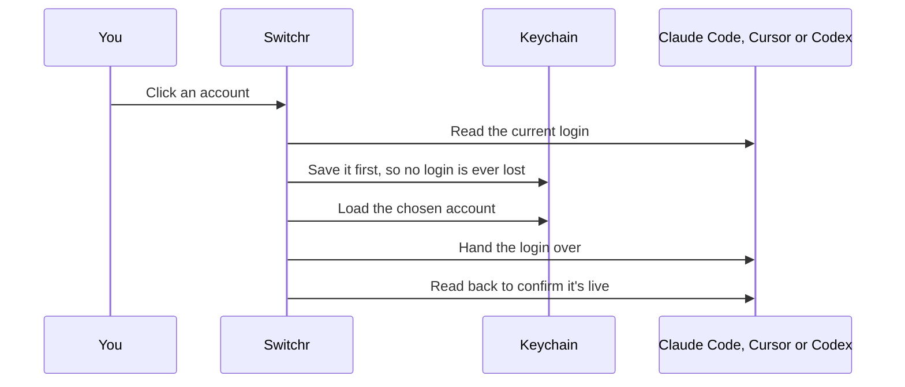

<p align="center">
  
</p>

<p align="center">
  Move Claude Code, Cursor or Codex onto another account in one click,<br>
  with every saved account's limits, usage and budget in view.
</p>

<p align="center">
  <a href="https://github.com/dominikzabcik/switchr/actions/workflows/ci.yml"></a>
  <a href="https://github.com/dominikzabcik/switchr/releases/latest"></a>
  <a href="LICENSE"></a>
</p>

<p align="center">
  <sub>macOS 14 or later · Apple silicon and Intel · runs in the menu bar</sub>
</p>

<p align="center">
  
</p>

## Install

```bash
curl -fsSL https://raw.githubusercontent.com/dominikzabcik/switchr/main/install.sh | bash
```

The installer downloads the latest release, checks its SHA-256, installs Switchr into Applications and opens it. Files downloaded this way aren't flagged by Gatekeeper, so macOS shows no security prompt. [Read the script](install.sh) before piping it into your shell.

<details>
<summary><b>Prefer a disk image?</b></summary>
<br>

Download `Switchr.dmg` from the [latest release](../../releases/latest), open it, and drag Switchr into Applications.

Switchr isn't notarized, so macOS blocks the first launch. Open **System Settings › Privacy & Security** and choose **Open Anyway**. If you launch Switchr straight from the disk image or from Downloads, it offers to move itself into Applications.

</details>

On first launch, a welcome window lists the logins Switchr found and turns on Open at login. When you close it, the menu bar icon plays a short animation so you can spot it.

<p align="center">
  
</p>

## Use

| | |
| --- | --- |
| **Add an account** | Sign in to the tool as usual and Switchr saves the login. For another account, choose **Add account** in that tool's tab. Switchr signs the tool out on this Mac only, so the saved token stays valid, and saves the next login you make. |
| **Switch** | Pick a tool's tab, then click one of its other accounts. Each shows the room left on its tightest limit. When the account in use runs low, the one with the most room is marked. Right-click an account to rename or remove it. |
| **Read the limits** | The account in use shows each limit as a large bar. The tick marks an even pace through the window. A bar turns amber when you're ahead of pace and rust past 90%, and "Runs out" replaces the reset time when the limit won't last until the reset. |
| **Insights** | Usage over time by account, API value, budgets, models and current limits. Open it from the menu's footer. |
| **Menu bar icon** | The in-use account's two nearest limits, for the tool you switched last. |

Codex logins made with an API key aren't supported, only ChatGPT sign-ins.

## Usage tracking

Switchr keeps its own record of what every account uses.

| Source | What Switchr reads |
| --- | --- |
| Claude Code | `~/.claude/projects/**/*.jsonl`, one entry per response, with input, cache writes (5-minute and 1-hour), cache reads and output |
| Codex | `~/.codex/sessions/**/*.jsonl`, per-response usage records, or running totals in older sessions |
| Cursor | Each saved account's usage export from cursor.com, at most twice an hour |

- **Per account:** each request is credited to the account that was in use at that moment. Switchr records every switch, including logins you change outside it. Usage from before Switchr started goes to the tool's only saved account when there's one.
- **API value:** requests are priced at each provider's standard API rates, from a table generated from [models.dev](https://models.dev). Subscriptions don't bill per token, so API value measures how much use you get, not what you pay. Cursor's on-demand charges are shown separately as billed.
- **Budgets:** set one per account or across all accounts, per day, week or month, in Insights. Switchr notifies you at 80% and at 100%.
- **Forecasts:** Switchr samples each limit and projects when it runs out at the recent rate. Once a limit is half used and on track to run out before it resets, a notification offers a **Switch** button that moves you to the saved account with the most room.

<p align="center">
  
</p>

## What a switch does



| Tool | Where the login lives | How it takes the new one |
| --- | --- | --- |
| Claude Code | Keychain item `Claude Code-credentials` (only `claudeAiOauth`; MCP tokens stay untouched), plus `oauthAccount` in `~/.claude.json` | Claude Code rereads its Keychain login every 30 seconds, so open sessions move over without a restart. |
| Cursor | `cursorAuth/*` rows in `state.vscdb`, plus `authInfo` in `~/.cursor/cli-config.json` | An open Cursor gets the tokens through its own login deep link (`cursor://cursorAuth`) and switches in place in under a second. A closed Cursor has its rows swapped directly. |
| Codex | `~/.codex/auth.json` | New runs use it straight away. A running session keeps its original account, so reopen it with `codex resume --last`. |

Tools rotate their tokens on their own, so Switchr re-saves the in-use login on every refresh. Limits are fetched with each account's own token. Switchr only refreshes tokens for accounts that aren't in use, so a running session never has its token rotated out from under it.

## Settings

Open the **…** menu in the footer.

| Setting | Default | What it does |
| --- | --- | --- |
| Check usage every 5 minutes | On | Reads limits and logs on a timer. Off, Switchr checks only when you open the menu or press Refresh. |
| Check for updates automatically | On | Asks GitHub for the latest release once a day. |
| Install updates automatically | On | Installs a verified release as soon as it's found, never during a switch, then reopens. |
| Open at login | Set in the welcome window | Starts Switchr when you log in. |

## Updates

Switchr updates itself from this repository's releases. It downloads `Switchr.zip`, checks its SHA-256 against the release's `SHA256SUMS`, confirms the bundle inside is the expected version, swaps it in place and reopens. A release without a checksum, or with one that doesn't match, is never installed. With automatic installs off, the menu shows an **Update** button instead. **Check for Updates…** in the **…** menu checks right away.

## Privacy

There's no analytics and no telemetry. Switchr's network requests are:

- **Limits:** each provider's usage endpoint, called with that account's own token: `api.anthropic.com`, `chatgpt.com` and `cursor.com`.
- **Token refresh:** for accounts that aren't in use, the providers' own sign-in services: `platform.claude.com` and `auth.openai.com`.
- **Cursor usage export:** `cursor.com`, per saved Cursor account.
- **Updates:** `api.github.com` and `github.com`, for release information and downloads.

Everything else stays on your Mac:

- **Saved logins:** your login Keychain, service `dev.switchr.vault`, one item per account.
- **Account names and labels:** `~/Library/Application Support/Switchr/accounts.json`. This file holds no tokens.
- **Usage history:** `~/Library/Application Support/Switchr/usage.sqlite`, readable only by you.

## Security notes

- Keychain calls go through `/usr/bin/security`, so there are no access prompts. Writes pass the credential as an argument, where other processes running as your user can briefly see it.
- The Cursor deep link hands tokens over through Launch Services and never appears in a process list.
- Releases are signed ad hoc, not notarized. Build from source if you'd rather not run a prebuilt binary.
- The endpoints are the private ones the tools call themselves, so a provider update can break Switchr. If that happens, [open an issue](../../issues/new/choose). Report vulnerabilities privately, as described in [SECURITY.md](SECURITY.md).

## Uninstall

1. Quit Switchr from the **…** menu.
2. Remove its saved logins, usage history and preferences:
   ```bash
   /Applications/Switchr.app/Contents/MacOS/Switchr --reset
   ```
3. Delete `/Applications/Switchr.app`.

Your tools stay signed in with whatever account was last in use.

## Development

```bash
swift test                          # unit tests
./scripts/build-app.sh --install    # universal build, copied to Applications and opened
./scripts/build-app.sh --release    # plus build/Switchr.zip, build/Switchr.dmg and SHA256SUMS
python3 scripts/update-pricing.py   # refresh model prices from models.dev
./scripts/render-art.sh             # re-render the icon, disk image background and banner
```

| Flag | What it does |
| --- | --- |
| `--probe` | Prints each tool's current login and limits without changing anything |
| `--reapply <claude\|cursor\|codex>` | Switches a tool to the login it already has, which exercises the whole switch path |
| `--usage-report <database>` | Reads local logs into the given database and prints totals |
| `--preview-menu [tool]`, `--preview-insights`, `--preview-welcome` | Shows real windows with sample data, for screenshots |
| `--update-now` | Installs the latest release over this copy without reopening it |
| `--reset` | Removes saved logins, usage history and preferences |

See [CONTRIBUTING.md](CONTRIBUTING.md) for the code layout and conventions.

## Releasing

1. Bump `VERSION` and add a matching section to `CHANGELOG.md`.
2. Commit, then tag and push: `git tag v$(cat VERSION) && git push origin v$(cat VERSION)`.

The [Release workflow](.github/workflows/release.yml) runs the tests, builds the universal app, zip, disk image and checksums, and publishes them with that changelog section as the release notes. [CI](.github/workflows/ci.yml) tests and builds every push.

## Terms and trademarks

Switchr moves between accounts you already have, such as a personal login and a work login. It doesn't give any account more usage than its plan includes. Using several accounts to get around one plan's limits can break a provider's terms, so read the terms for each service you use ([Anthropic](https://www.anthropic.com/legal/consumer-terms), [Cursor](https://cursor.com/terms-of-service), [OpenAI](https://openai.com/policies/row-terms-of-use/)) and use Switchr within them. Only save accounts that are yours: providers such as Anthropic don't allow sharing a login. If you'd rather Switchr make no requests on a timer, turn off **Check usage every 5 minutes**.

Switchr is an independent project. It isn't affiliated with, endorsed by or sponsored by Anthropic, Anysphere or OpenAI. Claude, Claude Code, Cursor, Codex and OpenAI are trademarks of their owners, and their logos appear only to identify each tool.

## License

[MIT](LICENSE). Provider marks come from [Simple Icons](https://simpleicons.org), and model prices from [models.dev](https://models.dev). See [`NOTICE`](NOTICE).
